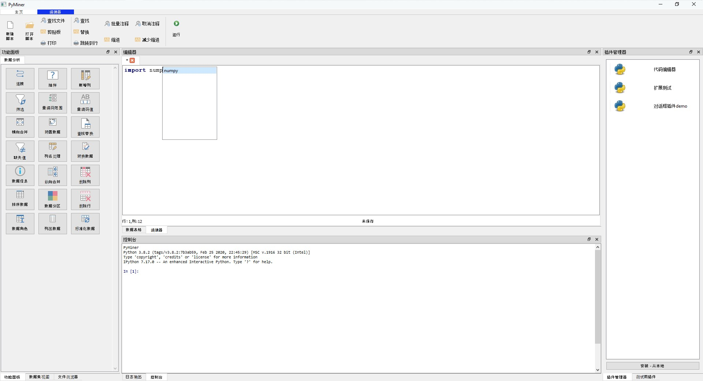
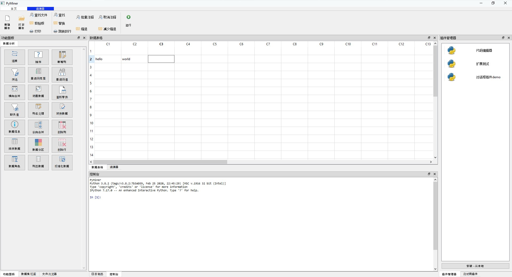

# PyMiner

    
    

#### 简介
PyMiner一款基于数据工作空间的数学工具，通过加载插件的方式实现不同的需求，用易于操作的形式完成数学计算相关工作。

#### 技术说明

项目开发环境支持跨平台，（windows,linux,mac 都支持！如果使用出现问题，欢迎提issue），建议使用Python3.8+PyQt5.15进行开发。

#### 安装

1. 下载项目源码 
2. 安装python并打开命令行工具，使用 pip install -r requirements.txt 导入python包，如果你的python依赖包下载太慢，建议使用：pip install -i https://mirrors.cloud.tencent.com/pypi/simple -r requirements.txt
3. 调用python 执行目录下 app2.py，例如python安装在C盘根目录下，可以在cmd命令行中执行：C:\python\python.exe C:\PyMiner\app.py

**注意，整个项目已经迁移至 pyminer2，请使用 app2.py 作为入口程序**

#### 联系我们

1.  作者：PyMiner Development Team
2.  邮箱：aboutlong@qq.com

#### 许可说明
本项目遵循GPL许可证。此外，对个人用户来说，本项目支持自由修改源码和使用，但是不支持任何未经授权许可的商用或其他盈利性行为，也不支持任何未经授权申请著作权的行为。如有违反以上许可，本项目管理团队有权进行否决。
许可解释权归属 PyMiner Development Team。

#### 预览

预览1

预览2

预览3

