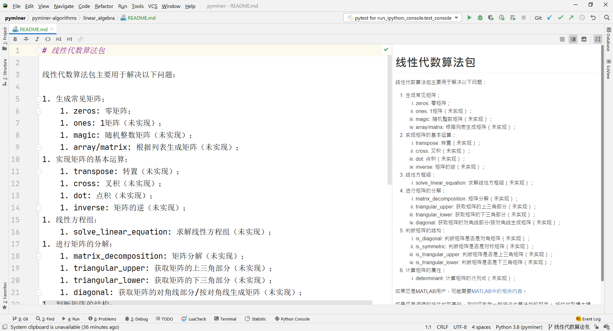
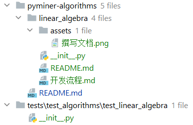
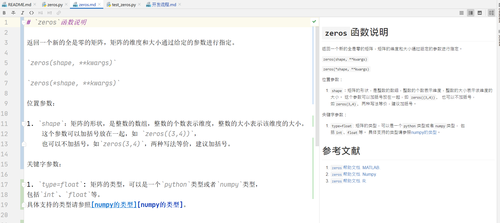
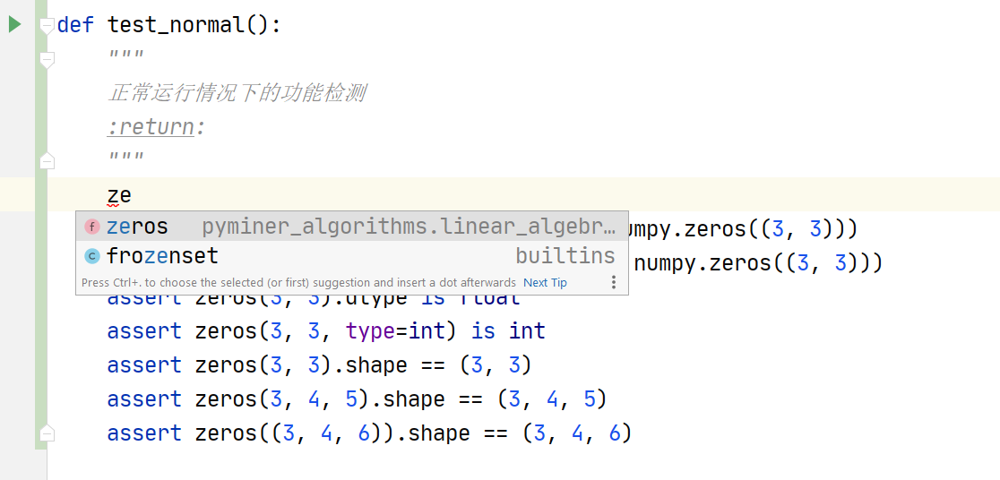
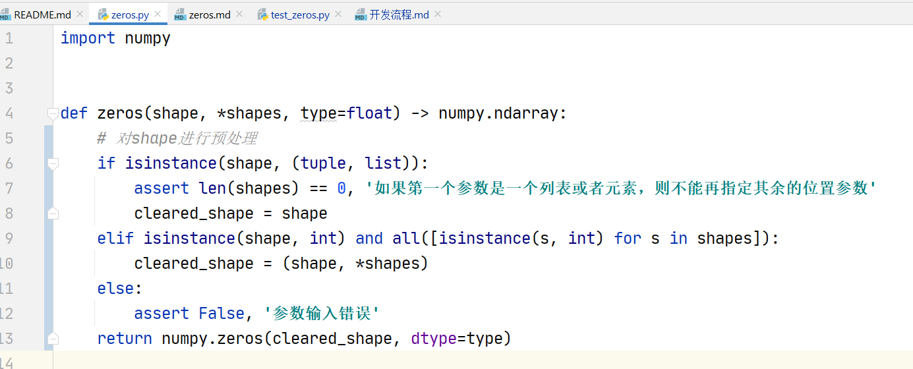
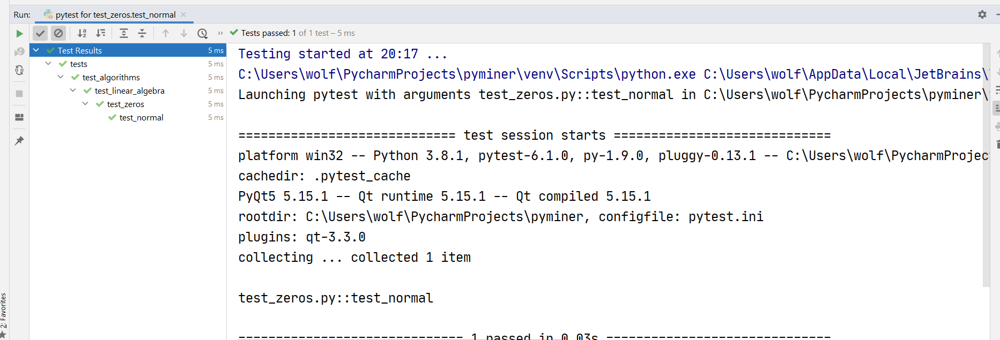
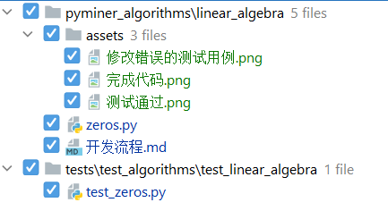
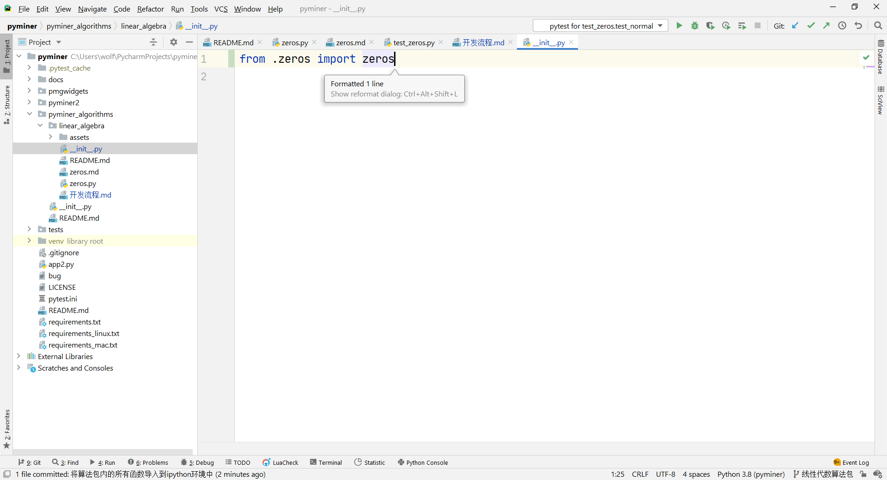
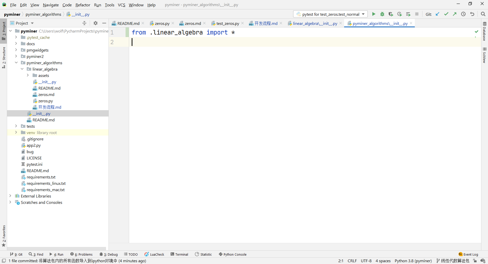
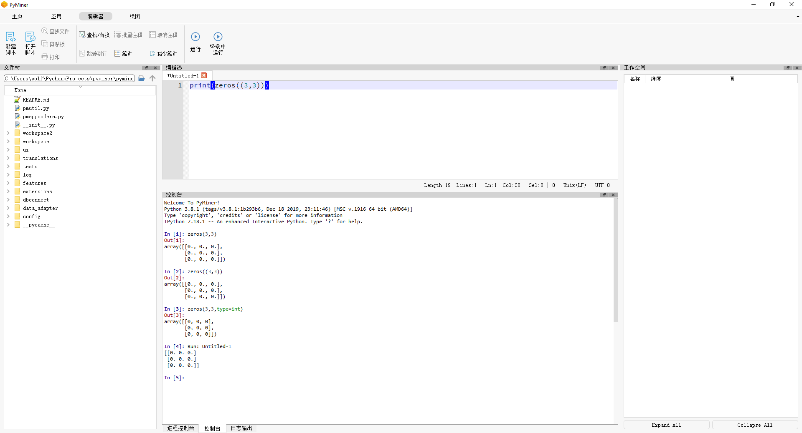

# Linear Algebra 函数包的开发流程

本文暂时弃用，正在将文档迁移至sphinx，后续会重新撰写此部分内容。

本流程为我在进行开发中的记录，
不能保证是最佳实践，但可以给各位提供一些参考。

## 撰写文档

在建立了文件夹结构后，首先完成README.md。
这个文档可以从`pyminer_algorithms/文档示例`中拷贝过来，
并基于该文档进行填充，以方便后期的文档分析。
这个文档可以供开发者整理自身的需求。
具体有哪些函数需要开发，可以在`matlab`、`R`、`scipy`等函数库的帮助文档中寻找。
由于线性代数这一部分`matlab`做的比较好，因此我主要采用了`matlab`的分类方式。

这一步骤主要改动了以下文件：

## 开发第一个函数，创建三个文件

按计划，需要开发`zeros`函数。
这个函数是`numpy`的常规函数，进行一个简单的封装就可以了。

分别在算法文件夹内创建`zeros.py`、`zeros.md`，在测试文件夹内创建`test_zeros.py`。

这个时候我的工作空间如下图所示。

这一步骤后的文件结构发生了如下变化：

这里的三个文件还都是空的。

## 写帮助文档

写帮助文档总是应当在代码之前完成。
写文档的过程本身也是对需求的整理的过程。

帮助文档肯定不是重新写的，那跟造轮子有什么区别。
去网上搜三门语言的帮助文档，作为参考文献先整理下来。
通读三门语言的文档，整理为我们的帮助文档。
**这一部分一定不要自己拍脑袋！一定要参考其他程序的内容！**

结合了多家文案，撰写了这份函数说明。
现在我非常清晰的知道我要做什么事情了。

这一次的文件变化如下所示，可以看到，除了几个与本“开发流程”有关的文件，
只更改了`zeros.md`文件。

## 开发测试用例

很多朋友可能会非常急于快速开始写代码，
对于这种易于单元测试的内容，我的观点一向是，
测试驱动开发。
“测试驱动开发”（TDD）的本质是“需求驱动开发”，
测试只不过是将`markdown`格式的需求变成了代码格式的需求。

不过现在可以在`zeros.py`里面先定义函数的框架，如下图所示：

这里的`raise NotImplementationError`表示，
这里应该有个东西，但是我还没有实现。
这是用于明确告诉调用方，这不是一个bug，是我还没有来得写。
先把这个框架搭在那里的好处是，我们在写测试用例的时候就有代码提示了：

这个函数名比较短，可能无所谓，对于二十个字母的函数，
比如`scattered_interpolate`这种函数，
一个一个敲进去还是很烦的。

如果您已经如下图所示配置了测试工具：

那这里就会有一个绿色的“播放”图标，点击后选择“运行测试”，如下图所示：

然后就可以得到如下的报错：

当然会报错了，而且会报错`NotImplementationError`，因为我们压根就没有实现这个函数。

不管这个报错，现在我们的测试用例写完了，我们的文件改动为：
`zeros.py`和`test_zeros.py`。这次图贴的比较多，因此图片文件占了一大堆。

## 开发函数

终于到了我们最喜欢的开发函数的时间了。
在经过了前面的需求分析与整理后，现在再封装这么一个小函数，
一般不会出现任何问题了。
放手去写吧！

代码如下：

测试用例刚才写的时候，学艺不精，写错了一点，配合代码一起改了：

终于，测试用例跑绿啦！

本步骤的代码文件变化如下：

## 补充需求

不动手开发，永远不知道方案有多少问题，所以很多人都会很急着开发。
尽管我们的方案如此详细，功能如此简单，在实际开发的过程中，我还是发现了问题。

我们的函数是通过`type`参数指定的类型，而`numpy`是通过`dtypes`参数指定的类型。
如果我们这样拍脑袋改了参数名，`numpy`的用户会非常不习惯。
因此我们有必要补充`dtypes`参数。

因为属于需求的变更，所以我们需要遵照之前的流程，重新走一遍：
首先改`zeros.md`，然后改`test_zeros.py`，最后写`zeros.py`。

文件变化情况如下所示：

## 将函数注入到ipython命名空间

我们开发函数的最终目的还是要让用户可以在`ipython`和脚本中可以使用。
那我们就需要将函数引入到`ipython`的命名空间中。
这一部分`PyMiner`框架已经完成了，只需要在`algorithms`中引入这个函数就可以了。

首先在子包的命名空间`linear_algebra.__init__`中引入`zeros`，如下所示：

然后在`pyminer_algorithms`的全局命名空间中引入，如下所示：

这样我们就可以直接通过`pyminer_algorithms.zeros`访问到这个函数了。

在`PyMiner`界面中，我们进行了这样的操作：
`from pyminer_algorithms import *`，
也就是这个命名空间下的所有变量都是可以直接在`ipython`解释器中访问的。

现在打开我们的`PyMiner`，调用这个函数：

成功了！我们完成了一个函数的开发！

## 后续

时间问题，我们不可能做到面面俱到。
这是我们目前有操作性的最大程度了，
如果让我们一次性写出完善的文档、翔实的测试用例，
我们可能要开发几十年。
但是并不是说我们不应该做，只是可以交给新加入项目的人来做这件事。
任何开源社区都是存在梯度的，核心成员做核心工作，比如开发算法。
外围人员和新人做简单工作，比如撰写文档、测试函数、补充测试用例。

您可能会问，我们不是写完文档和测试用例了吗？
您可以看一下[MATLAB的zeros函数的文档][MATLAB-zero]。
拖一拖进度条就可以发现，我们做的只是前面的1/10的工作。
后面还有详细的各种稀奇古怪的用法，我们是没有做的。

您可能会问，我们不是写好测试了吗？
对于这个函数，可能确实够了，等什么时候报错，再添加新的测试用例。
这边还是推荐您看一个小笑话，[一个测试工程师的故事][测试工程师]。

[测试工程师]: https://www.zhihu.com/question/20034686/answer/52063718

[MATLAB-zero]: https://ww2.mathworks.cn/help/matlab/ref/zeros.html?s_tid=srchtitle

## 致谢

大小也是写了好几个小时的文档，写个致谢不过份吧。

首先感谢您的阅读，感谢您读完了这篇文章。
然后要感谢项目组给我的信任，特别是龙哥一直以来对我的帮助。
感谢项目组做出的付出，前人栽树后人乘凉，
如果不是项目组的付出我也没机会写这篇教程。
最后，致敬开源世界。