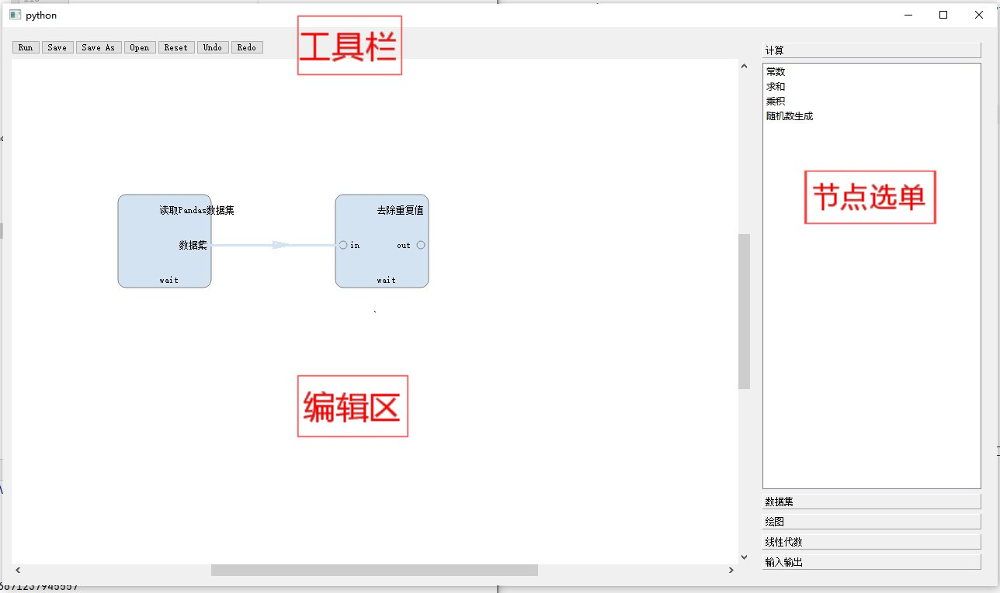

# PyMiner流程图系统用户手册

## 打开方式
直接执行这个文件：
`pyminer2/extensions/packages/flowchart/start_flowchart.py`

## 界面介绍

- 工具栏:进行相关操作
- 编辑区：在这里进行流程图的编辑
- 节点选单：在这里选择不同的节点类型，节点可以分为以下几类：
  - 计算：有求和、求积、生成随机数等简单计算。
  - 数据集操作：去重、缺失值替换、批量替换等。
  - 绘图：绘制折线图、茎叶图等
  - 线性代数：矩阵操作等
  - 输入输出：从文件中导入，或者从工作空间中导入；输出到文件或者工作空间。
  - 未来还将增加一些机器学习模型。

## 基本操作
### 添加节点

双击右侧的节点选单插入新的节点即可。

### 连线
#### 节点介绍

流程图由节点和连线组成，每一个节点通过端口与连线相接。以求和节点为例，它包含两个入端口（in1\in2）和一个出端口（out）。

#### 连线方式

单击节点的一个出端口即可开始连线。连线时要注意以下规则：

- 连线必须开始于某节点的入端口。

- 连线必须终止于**不同节点**的入端口，否则无法连接。

- 一个出端口可以连接多个入端口，但一个入端口不能接受多个出端口的输入。

### 运行代码

  点击工具栏的`Run`即可运行。节点代码执行后，会在此节点位置显示执行的输入输出结果。

### 查看节点的输入和输出值

双击节点即可查看输入和输出值。

输入和输出值以列表的形式呈现，依次为各个端口从上到下的呈现。

## 节点及其文件定义

### 节点的文件
- 与`PyMiner`主程序有调用关系（如向工作空间传递变量）的节点，位于`pyminer2\extensions\packages\flowchart\plugin_nodes`
- 与`PyMiner`主程序无耦合关系的节点（大多数节点都是这样的），位于`widgets/flowchart/nodes`

### 节点的注册
- 少数与`PyMiner`主程序有调用关系的节点，位于`pyminer2/extensions/packages/flowchart/start_flowchart.py`中，`DataProcessWidget`的`load_nodes_library`方法
- 多数与`PyMiner`主程序无调用关系的节点位于`widgets/flowchart/dataprocesswidget.py`中，`PMDataProcessFlowWidget`类的`load_nodes_library`方法
