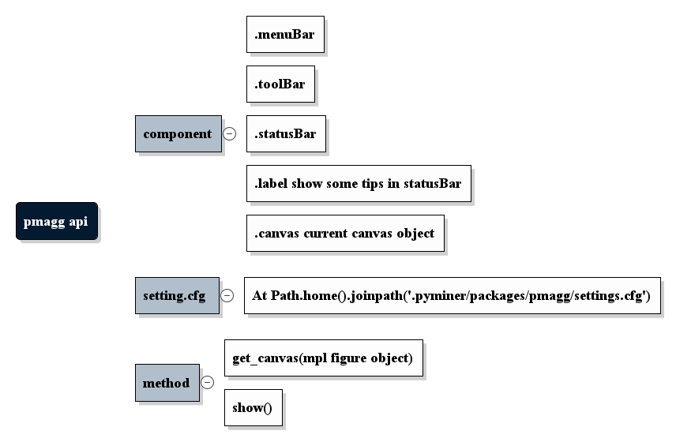

PMAgg是一具有更加丰富的交互能力matplotlib后端，基于PySide2实现。
目前集成于开源项目[Pyminer](https://gitee.com/py2cn/pyminer)，作为默认的绘图界面，以期实现类似matlab的绘图窗口。

基本功能介绍
====================

右键功能：右键点击曲线，图例，文字，矩形，椭圆等对象可以实现删除该对象或修改样式

save: 将绘图保存为各种图片格式

setting：修改坐标轴，标题，默认的字体，网格，注释风格选择

home: 删除所有的附加元素，如矩形，注释，文字等

front/back: 将平移前后的图形调整回来

zoom/pan: 选中缩放和平移

rotate: 3D旋转，及在工具栏2的六个定向视图

text: 添加文字，支持LaTeX公式

rect/oval：添加矩形和椭圆标注，显示中心坐标及面积，用于测量等

annotation：在曲线上添加额外的点标注，可以进行丰富的样式修改

grid：显示或隐藏网格

legend：显示或隐藏图例

colormap：修改colorbar颜色风格，待实现

将PMAgg嵌入其它的PyQT5程序中
===================================

将PMAgg嵌入其它的PyQT5程序的过程及其简单，你需要拿到matplotlib绘图得到的figure对象，以及再传给PMAgg一个配置文件路径即可，
这个配置文件用来保存一些默认的字体、网格、注释等风格的设置。

你还可以隐藏工具栏，或者将工具栏放置在其它的位置。

PMAgg默认集成了大量的mpl监听事件，如果你不需要进行绘图的交互，你可以选择关闭所有的监听事件，或者分别选择关闭工具栏监听事件或右键菜单功能。

.. code-block:: python

    import sys
    from PySide2 import QtWidgets
    import matplotlib.pyplot as plt
    import random
    import PMAgg
    import os

    class MainWindow(QtWidgets.QDialog):
        def __init__(self, figure, config_path):
            super().__init__()
            layout = QtWidgets.QVBoxLayout()
            mpl_app = PMAgg.Window(config_path)
            # 只需要将mpl绘图产生的figure对象以及一个配置文件.cfg的路径传给PMAgg即可，配置文件可以留空。
            mpl_app.get_canvas(figure)
            layout.addWidget(mpl_app)
            # 一个额外的按钮
            self.button = QtWidgets.QPushButton('test')
            layout.addWidget(self.button)
            self.setLayout(layout)

    if __name__ == '__main__':
        # matplotlib 绘图
        fig = plt.figure()
        ax = fig.add_subplot(111)
        data = [random.random() for i in range(25)]
        ax.plot(data, '*-')
        # app
        app = QtWidgets.QApplication(sys.argv)
        config_path = os.path.join(os.path.dirname(__file__), 'settings.cfg')
        main = MainWindow(fig, config_path)
        main.setWindowTitle('Simple PyQT5 and PMAgg example')
        main.show()
        sys.exit(app.exec_())