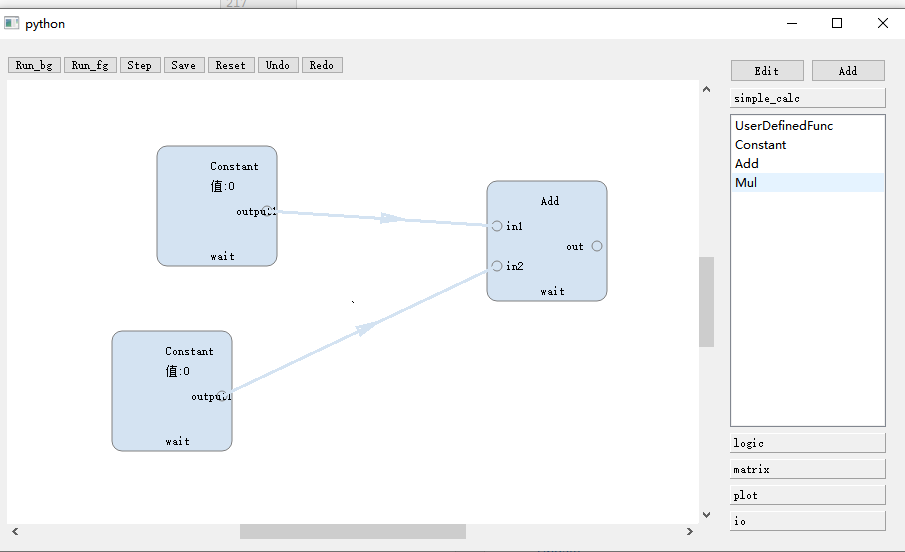

# 使用面向对象方式进行节点创建
## 简单示例解析
1、在widgets/flowchart/nodes/simplecalc.py
仿照现有的节点，编写一个现有的节点名为Mul.
如果想要建立其他文件，可以在同一目录下建立。
需要继承PMGFlowContent这个基类。
我们参考Add这个类。
不妨将Add类复制一遍之后，在其上加以修改。
```python
class Mul(PMGFlowContent):
    def __init__(self):
        super().__init__()
        self.input_args_labels = ['in1', 'in2']
        self.output_ports_labels = ['out']
        self.class_name = 'Mul'
        self.text = '乘积'
        self.icon_path = ''

    def process(self, *args) -> List[object]:
        if len(args) > 1:
            mul = args[0]
            for a in args[1:]:
                mul *= a
        else:
            raise ValueError
        return [mul]
```
对于PMGFlowContent类有以下方式：
- input_ports_labels:输入端口的文字列表。根据这个列表将自动生成输入端口，输入端口的数量与列表长度一致，文字从上至下依次为列表
从前往后的各个项。
- output_ports_labels:输出端口的文字列表，含义同输入端口文字列表。
- class_name:节点的类。一般应当以英文明明
- text:节点的文字，支持中文等utf-8编码的字符。
- icon_path:图标的属性（尽量用绝对路径）

注意事项：
- `__init__(self)`方法除了`self`之外，不能有任何参数。


2、在widgets/flowchart/core/flowchart_widget.py中，跳转到load_nodes_library(self)这个方法。
```python
def load_nodes_library(self):
    from widgets.flowchart.nodes.simplecalc import Constant, Add
    self.node_manager.register_node_content(Constant, 'simple_calc', 'Constant')
    self.node_manager.register_node_content(Add, 'simple_calc', 'Add')

```
添加导入Mul，并且照葫芦画瓢，将代码改成：
```python
def load_nodes_library(self):
    from widgets.flowchart.nodes.simplecalc import Constant, Add, Mul
    self.node_manager.register_node_content(Constant, 'simple_calc', 'Constant')
    self.node_manager.register_node_content(Add, 'simple_calc', 'Add')
    self.node_manager.register_node_content(Mul, 'simple_calc', 'Mul')
```
`simple_calc`指的是简单计算这一分组。

运行这个文件，即可看见新的节点`Mul`已被创建。双击右键即可插入。
点击run_fg即可运行。但注意，至少要有两个模块和一条连接线。一个简单的示例如下图。
双击节点，可以查看节点的输入值和输出值。


3、点击设置弹出窗口效果
参考simple_calc.py下的Constant类，重写其on_settings_requested(self, parent)方法即可。
在这个节点上点击右键，即可弹出这个窗口。
大概像这样：
```python
def on_settings_requested(self, parent):
    dlg = QDialog(parent=parent)
    dlg.exec_()
```

4、设置显示的文本内容
参考Constant类，重写format_param(self)方法即可。大概如此：

```python
def format_params(self):
    return "hello"
```

这样节点就会显示“hello”文本。

5、设置图标（未做）

6、设置存储信息
节点的info属性会在保存时保存和加载。只要修改info属性即可。
