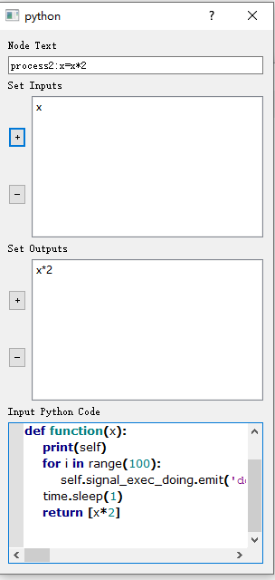

# 流程图

widgets.flowchart是流程图绘制子包。依赖于networkx和qtpy。

简单的示例可以直接执行`widgets/flowchart/flowchart_widget.py`

## 组成部分


使用：

```python
from widgets import PMFlowWidget
app = QApplication(sys.argv)
graphics = PMFlowWidget(path=r'C:/Users/12957/Desktop/乡土中国.pmcache')
graphics.show()
sys.exit(app.exec_())
```

PMFlowWidget可以像普通的QWidget那样嵌套在任何位置。

启动参数：

parent:指定父控件。

path:指定启动时加载的流程图。

PMFlowWidget暂时不支持清空重绘。可以销毁当前控件再新建一个控件。

## 操作

### 预留节点

很多节点是已经预留好的。比如求和、求积等。

### 添加节点


点击右键菜单的New，即可插入一个新的自定义节点。

也可单击节点菜单插入新的节点。

### 连线

单击节点的一个出端口即可开始连线，连线**必须终止于不同节点的入端口**，否则无法连接。


### 编辑节点

双击节点即可编辑



- Node Text:节点显示的文字信息
- Set Inputs:输入节点端口编辑。点击`+`可以添加一个端口，点击`-`删除当前端口。双击选项可以编辑文字。
- Set Outputs:输出节点编辑，和输入相同
- Input Python Code:输入Python代码，是节点执行的内容。
### 运行代码
点击`Run`即可运行。节点代码执行后，会在此节点位置显示执行的输入输出结果。

执行之前情况如下

执行之后情况如下：

图片：image-20201017130216358
路径：C:/Users/12957/AppData/Roaming/Typora/typora-user-images/image-20201017130216358.png
请检查此路径。

### 集成到程序中并运行代码

#### 在UI线程中直接运行代码

参考widgets/flowchart/tests/continously_data_process.py文件中的内容
可以这样做：

获取流程图的对象

```python
graphics = PMFlowWidget(path='continously_data_process.json')
graphics.show()
result = graphics.run_in_fg([1])
```
`run_in_fg`方法适用于有明显的开始和结束节点的情况。

在执行时，所有的节点将会进行**拓扑排序**。拓扑排序的目的，就是保证**节点的执行顺序符合用户连线的规定**。但是，当输入节点不唯一或输出节点不唯一时，
（输入节点指的是“有出无进”的节点，而输出节点指的是“有进无出”的节点。）不能保证第一个执行的节点具体是哪个输入节点，或者
最末一个输出节点是哪个输出节点——由此，就会出现错误。所以目前输入参数只支持输入和输出节点唯一的情况。

`run_in_fg`的参数为一个列表（list）,被传入第一个节点，然后以`*args`的方式展开为参数。返回值则是**最后一个节点的执行结果**。
注意，第一个节点的参数和返回值都是list型，解包和打包操作在内部完成。

[TODO!]之后需要支持用户指定输入和输出节点！

`run_in_fg`方法可以让我们的流程图直接在UI线程之中处理计算任务，并且直接获取输出值。对于耗时不明显的操作，直接在前端中处理更加及时、准确、直观。当然，如果希望在运行过程中屏蔽用户对流程图的操作（比如说，程序执行过程中删除某个节点，可能导致灾难性的后果），那么使用这个方法应当也是可以的。

当然，这对于UI线程而言，是本职工作之外的琐事。如果“琐事”消耗的时间太长，就会导致界面卡滞，严重影响用户体验。这样就需要在后台线程运行代码了。

#### 在后台线程中运行代码

[!TODO]接口已经留好，未完待续。。。

#### 插入预定义节点

在节点窗口中，点击“Add“可以创建一个自定义节点，双击列表项可以将节点插入到图形窗口中。点击‘‘Edit’’可以编辑当前选中的项。

自己新建的自定义节点将被保存。

### 自定义代码的规范

- 输入参数数量与输入端口数目相同
- 输出参数需要用列表包裹起来，列表长度与输出端口数目相同
- 输入参数从左到右依次为输入端口从上到下的值，输出参数从左到右依次为输出参数从左到右的值。

比如以下代码是规范的：

```python
import time
def function(x):
    return [x*2]
```

可以给函数添加默认值参数：

```python
import time
def function(x=123):
    return [x*2]
```


## 示例

在widgets/flowchart/tests里面有一些示例可以供参考。
