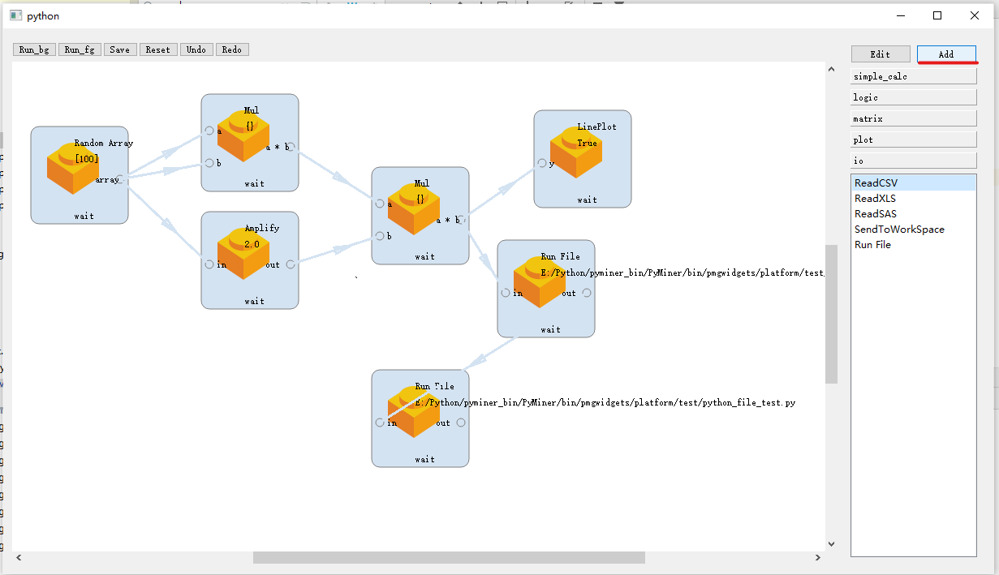
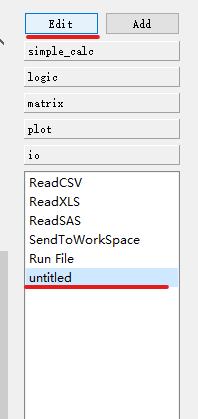
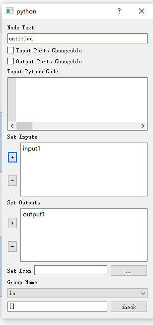
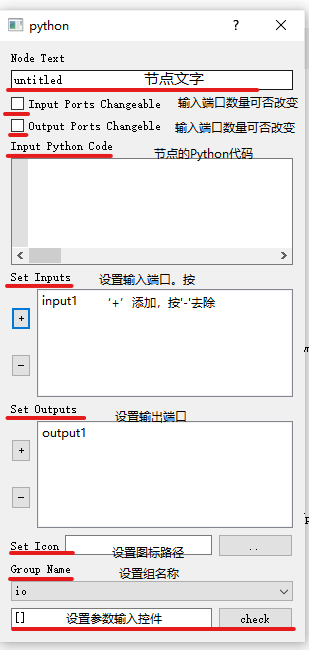
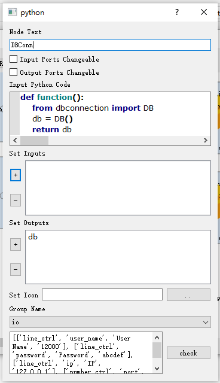
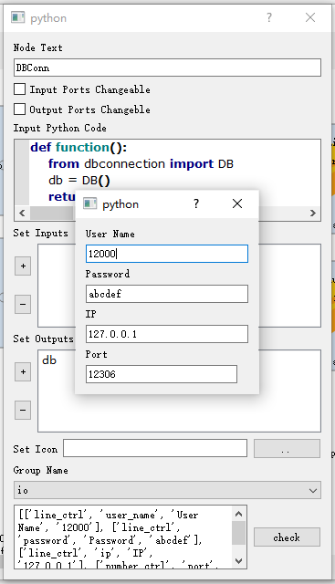
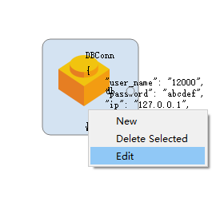
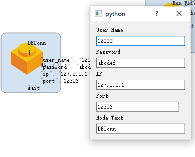

# 如何创建一个新的节点类


## 添加新节点类
点击Add按钮添加一个节点

## 编辑
选中新增的`untitled`项，并且点击Edit编辑。

弹出编辑面板效果如下：

编辑面板的含义如下：


## 实例

若要创建一个数据库连接节点，我们将其抽象为：

- 节点文字：DBConn
- 输入端口没有，输出端口一个，数量不得改变。输出端口命名为‘db’
- 图标暂不设置，使用默认图标
- 组名称为IO(可以点击下拉菜单切换组名称)

- 设置信息：ip地址、端口、用户名、密码。因此需要根据widgets的方式编写设置面板的json。

编写后的效果如下：


其中，函数的输入只是一个实例。最后一栏的JSON全文如下：

```json
[
    ['line_ctrl', 'user_name', 'User Name', '12000'],
	['line_ctrl', 'password', 'Password', 'abcdef'],
    ['line_ctrl', 'ip', 'IP', '127.0.0.1'],
    ['number_ctrl', 'port', 'Port', 12306, '', [0, 65535]]
]
```

点击`Check`按钮可以检验输入框的效果，弹出的对话框将反映你写的json可否正确的被转换为界面元素。


直接点击右上角叉号退出对话框即可，你的变更将被自动保存。对话框关闭的瞬间，所做的变更将被存储到磁盘中，无需担心数据丢失。

## 新建节点

双击“DBConn”列表项，即可插入一个DBConn节点。

点击右键“Edit”，即可编辑它。

弹出的设置面板效果如图:


点击“x”号，信息也会自动保存。