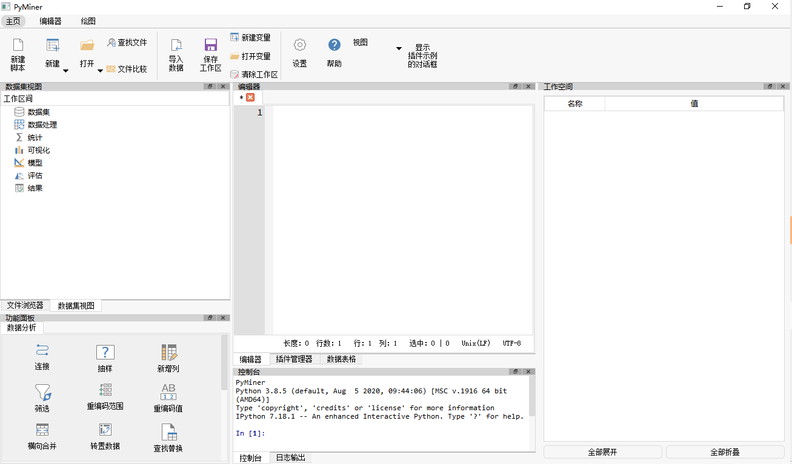
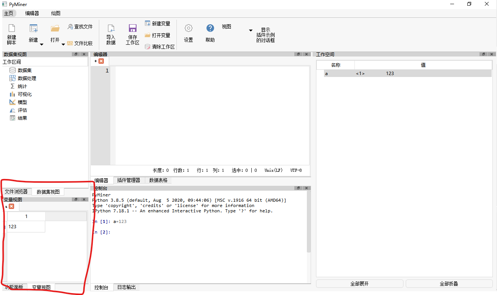

# 图形界面部分代码说明以及代码结构
## 项目规范说明
图形界面部分的项目规范基于Python3.8，但尽量不使用装饰器、动态属性、海象运算符等特殊语法，从而保证规范、清晰、易于维护。
### 大规模使用的特性：
- 1、typehint。（类型提示）
主要包含typehint的一般写法（比如`def func(s:str):`）提示时导入的TYPE_CHECKING。
- 2、lambda的匿名函数及其相关性质
- 3、PyQt5的基础知识（包括布局、信号与槽等）。界面部分可以使用设计师或者纯手写代码。
### 代码命名规范：
- 1、**变量名、函数名、方法名** 使用小写字母加下划线，从而与pyqt的原生接口相区分。
- 2、**类名** 使用大写字母驼峰命名，首字母或者缩写大写。
- 3、**包名、文件名** 使用纯小写字母+数字，除必要之外不使用下划线。
## 项目的结构：
与图形界面有关的类都定义在ui文件夹下面。
- base文件夹：里面是与老版本Pyminer进行兼容的代码
- common文件夹：通用的代码，负责与操作系统沟通，对Pyminer提供统一的函数。比如打开系统的命令行窗口等。
- generalwidgets:定义了通用控件，只依赖于PyQt或者generalwidgets包内部互相依赖，不依赖于pyminer。
- pmwidgets:半通用控件，与其他部分没有耦合，但依赖于Pyminer的主界面才能执行功能。
- source:资源文件，图像、图标等
- test：测试文件（目前不用）
注意在generalwidgets和pmwidgets命名的区别：generalwidgets中控件类名都以PMG开头，pmwidgets里面都以PM开头。G代表‘general’

## 界面插入的逻辑
对于对话框、工具栏来讲，自然无所谓插入界面的问题；但对于以dockwidget形式停靠在窗体各个位置的控件而言，位置的问题就很重要了！

相应的参数有：{'n', 's', 'w', 'e', 'nw', 'ne', 'sw', 'se', 'c'}几种，分别代表上、下、左、右，左上....

逻辑是这样的：
n代表y方向最小（因为Qt的坐标系统就是左上角为原点），x方向中等；
w代表x方向最小，y方向中等；
se代表x,y方向都是最大（右下角）。
c代表x\y都是中等大小。

比如屏幕中的控件有三列的时候：

'中等'代表插入第二列，'最小'代表插入第一列；’最大‘代表插入最后一列。
如果列数不足三列，假如为1或者2列，那么max代表的自然就是第1和第2列。因此即便不满足要求，也不会出现异常。

中间的含义是第2个（如果有的话。如果没有，那么也是插入第一列。）

选出列之后，再选择行,也就是Y坐标。同样n代表Y最小，s代表y最大。没有n或者s的话，代表取中间。
这样，将参数设置为’sw‘之后，就可以插入到这里了。

p.s.以上的n、s、w、e、c代表的分别是’东西南北中‘，而比如’sw‘就代表西北，亦即左上角。
