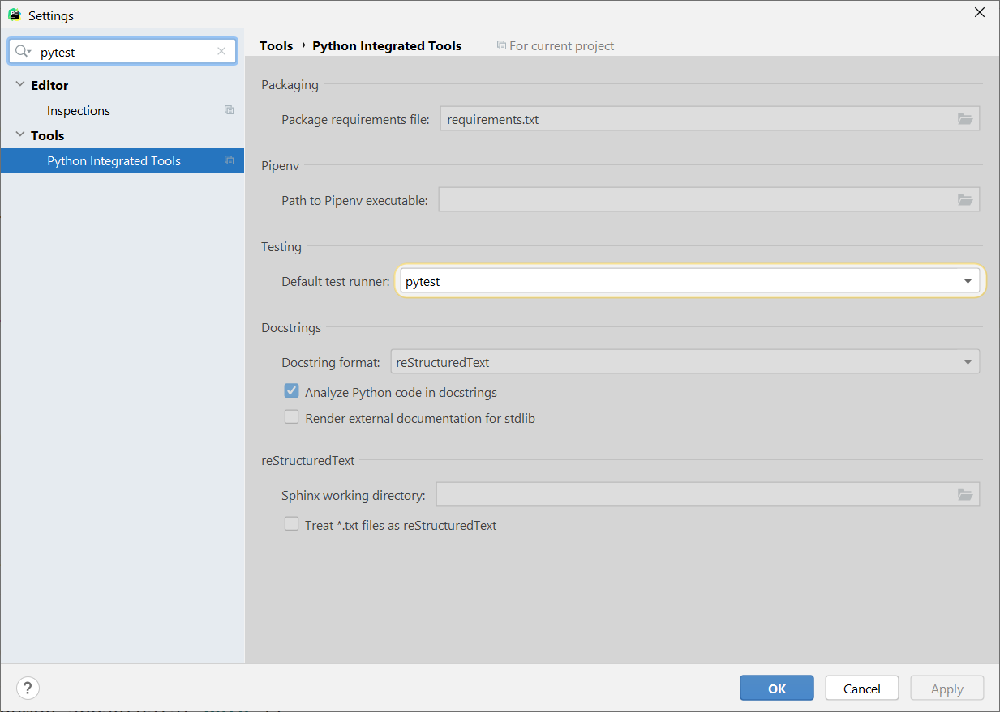
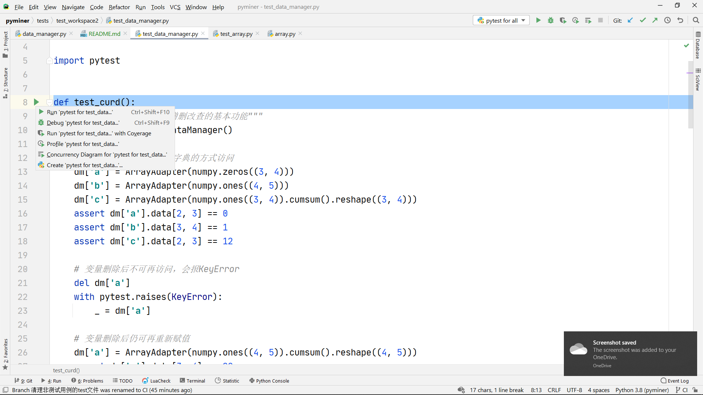
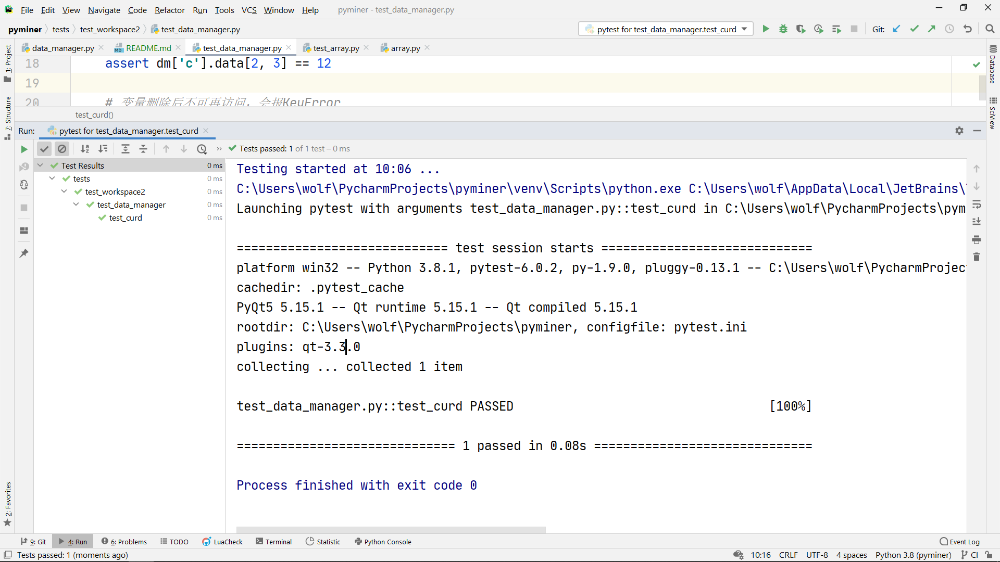
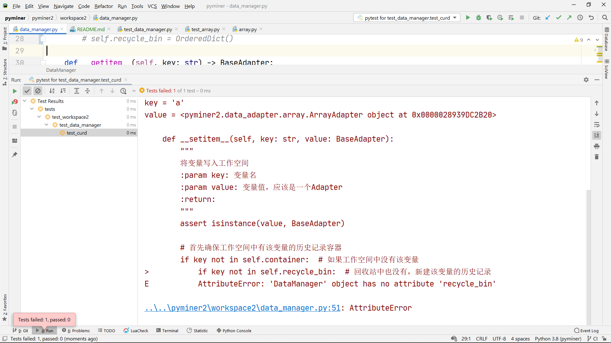
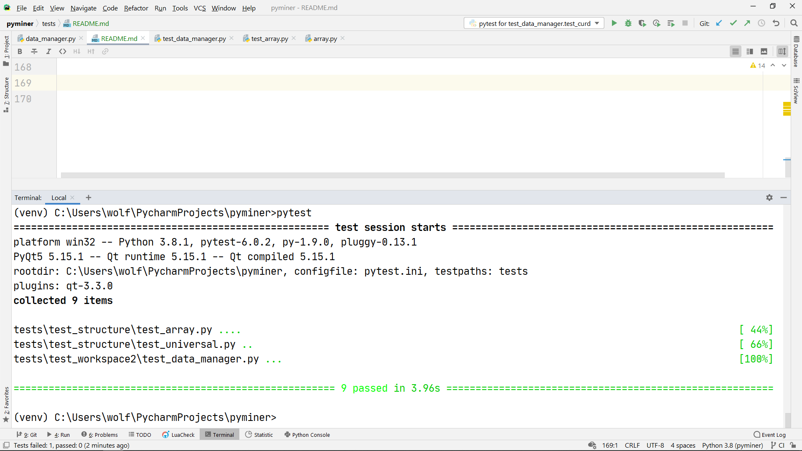

# 测试用例参考规范

首先，欢迎讨论，此处的规范不一定是最佳实践，如有更好的方案请评论直接改readme。

# 测试驱动开发的好处

这里提供一个简短的[文章](https://blog.ihuxu.com/the-advantages-of-tdd/)介绍了TDD的好处，用于参考。其核心内容如下：

1. 站在用户的角度去看产品：尽可能想到用户的所有操作，而不是从程序员的角度想用户应该会如何去使用我们的产品。
1. 为编程提供指导：先写测试再写代码，可以对代码提供指导性的参考，防止漏掉功能。
1. 它使我们对自己代码有了信心，因为我们事先设计好的所有测试用例都Pass了。
1. 精确定位问题：如果在更改代码后测试用例不能通过，我们可以根据不能通过的测试用例精确的定位问题，并轻而易举的解决的这个bug。
1. 随意使用重构：重构改变的是代码的内部结构，而不会改变外部接口功能，测试用例是保证我们在进行重构时，不会影响到代码的外部接口功能。

关于CI持续集成工具链的使用，也是要建议在完整的测试用例的基础上的。
这里有一篇[文章](https://www.redhat.com/zh/topics/devops/what-is-ci-cd)介绍什么是CI/CD。
这一部分github上面的项目通常采用travis来解决，而码云这边开发了`jenkins`也同样是可用的。
不过目前不打算在这一部分发力，如果有大佬用过的话可以把CI做一下。

# 算法与界面分离

算法应当作为界面的一个外壳，算法与界面进行解耦。

算法是易于进行单元测试的部分，而界面并不容易进行单元测试，因此如果二者强耦合，我们将同时无法对界面和算法进行单元测试。

界面部分建议采用手动测试的方案。`pytest-qt`支持界面的自动化测试，但个人认为意义不大（至少项目前期是这样），也咨询过大佬，徒增工作量。

# 测试用例规范（暂行）

所有的测试用例都应放在`/tests/`文件夹下，文件夹结构与`/pyminer2/`文件夹结构保持一致。

测试用例文件以`test_`开头，函数以`test_`开头，否则`pytest`无法识别。

对于手动运行的测试用例，可以把测试用例文件命名为`run_*`，这样就不会被`pytest`识别。

# 基于测试的开发的流程示例

这一部分我会采用PyCharm采用测试驱动开发的方案开发一个功能，流程不一定完美，欢迎提供参考。

功能目标：实现workspace的管理功能。

首先，我们需要在pycharm中打开对pytest的支持，如下所示。



然后，站在用户（插件开发者）的角度，考虑这个插件应当如何被使用：

1. 支持增删改查；
1. 支持历史记录；
1. 支持常用的字典方法，即`items()`等方法。

由于篇幅所限，这里仅以CURD功能为例。

```python
import numpy
import pytest
from pyminer2.workspace2 import data_manager
from pyminer2.data_adapter import ArrayAdapter

def test_curd():
    """测试数据管理工具的增删改查的基本功能"""
    dm = data_manager.DataManager()

    # 变量赋值后可以直接按字典的方式访问
    dm['a'] = ArrayAdapter(numpy.zeros((3, 4)))
    dm['b'] = ArrayAdapter(numpy.ones((4, 5)))
    dm['c'] = ArrayAdapter(numpy.ones((3, 4)).cumsum().reshape((3, 4)))
    assert dm['a'].data[2, 3] == 0
    assert dm['b'].data[3, 4] == 1
    assert dm['c'].data[2, 3] == 12

    # 变量删除后不可再访问，会报KeyError
    del dm['a']
    with pytest.raises(KeyError):
        _ = dm['a']

    # 变量删除后仍可再重新赋值
    dm['a'] = ArrayAdapter(numpy.ones((4, 5)).cumsum().reshape((4, 5)))
    assert dm['a'].data[3, 4] == 20

    # 变量再删除再重新赋值后，不影响结果
    del dm['a']
    with pytest.raises(KeyError):
        _ = dm['a']
    dm['a'] = ArrayAdapter(numpy.ones((6, 7)).cumsum().reshape((6, 7)))
    assert dm['a'].data[5, 6] == 42
```

在写测试用例的时候，我们会发现这时是没有代码补全的，
因此我们可以先写一个临时的空的`data_manager`模块，各个函数均使用`NotImplementationError`代替：

```python
# data_manager.py
class DataManager(object):
    def __init__(self):
        raise NotImplementedError
    def __getitem__(self, item):
        raise NotImplementedError
    def __setitem__(self, key, value):
        raise NotImplementedError
    def __delitem__(self, key):
        raise NotImplementedError
    def keys(self):
        raise NotImplementedError
    def values(self):
        raise NotImplementedError
    def items(self):
        raise NotImplementedError
```

有这个假的结构后，我们在写测试用例时就会有代码补全提示了。

在完成测试用例的开发后，可以进行实际的功能开发。

```python
from typing import Dict, Tuple, List
from collections import OrderedDict
from pyminer2.data_adapter import BaseAdapter
class DataManager(object):
    def __init__(self):
        self.container: Dict[str, Tuple[List[BaseAdapter], List[BaseAdapter]]] = dict()
        self.recycle_bin = OrderedDict()

    def __getitem__(self, key: str) -> BaseAdapter:
        current, future = self.container[key]
        current or self.__raise_key_error(key)
        return current[-1]

    def __setitem__(self, key: str, value: BaseAdapter):
        assert isinstance(value, BaseAdapter)

        # 首先确保工作空间中有该变量的历史记录容器
        if key not in self.container:  # 如果工作空间中没有该变量
            if key not in self.recycle_bin:  # 回收站中也没有，新建该变量的历史记录
                self.container[key] = ([], [])
            else:  # 从回站中恢复
                self.container[key] = self.recycle_bin[key]
                del self.recycle_bin[key]

        # 处理历史记录相关内容
        current, future = self.container[key]
        if future:
            future.clear()
        current.append(value)
        if len(current) > 15:  # 对每个变量的最多保存的历史记录数量
            current.pop(0)

    def __delitem__(self, key: str):
        key in self.container or self.__raise_key_error(key)
        self.recycle_bin[key] = self.container[key]
        del self.container[key]

    def __raise_key_error(self, key: str, position='工作空间'):
        raise KeyError(f'{position}未定义变量：{key}')
```

在完成这一部分的代码之后，打开这个`test_workspace2`的文件，执行这一部分的算例：



如果执行通过，就是这样的结果：



如果执行失败，就是这样的结果：



如果执行通过，说明这一部分我们的代码是可以正常执行功能的，我们就可以开发下一个功能了。

在提交前，我们需要对所有已有的测试用例进行测试，以防由于我们对代码不熟悉而导致代码的其余地方被我们改错了。
打开pycharm的命令行输入`pytest`命令即可。
（建议在venv环境中使用，关于pycharm的venv虚拟环境搭建请自行查阅教程）



如果测试通过，我们就可以放心大胆的提交了！

**注意！**

完成了以上步骤，只能说我们的代码可以正常执行功能，不能说我们的代码可以胜任复杂的工作条件！

单元测试的另一个优点是，每一个被测函数足够小。我们可以为每一个被测函数指定多组相应的输入与输出。

测试用例的一大要求是，站在用户的角度考虑问题。这需要项目长期的打磨，用户的不断反馈，才能实现健壮可靠的代码。贴一个老笑话：

> 一个测试工程师走进一家酒吧，要了一杯啤酒；
>
> 一个测试工程师走进一家酒吧，要了一杯咖啡；
>
> 一个测试工程师走进一家酒吧，要了0.7杯啤酒；
>
> 一个测试工程师走进一家酒吧，要了-1杯啤酒；
>
> 一个测试工程师走进一家酒吧，要了2^32杯啤酒；
>
> 一个测试工程师走进一家酒吧，要了一杯洗脚水；
>
> 一个测试工程师走进一家酒吧，要了一杯蜥蜴；
>
> 一个测试工程师走进一家酒吧，要了一份asdfQwer@24dg!&*(@；
>
> 一个测试工程师走进一家酒吧，什么也没要；
>
> 一个测试工程师走进一家酒吧，又走出去又从窗户进来又从后门出去从下水道钻进来；
>
> 一个测试工程师走进一家酒吧，又走出去又进来又出去又进来又出去，最后在外面把老板打了一顿；
>
> 一个测试工程师走进一；
>
> 一个测试工程师走进一家酒吧，要了一杯烫烫烫的锟斤拷；
>
> 一个测试工程师走进一家酒吧，要了NaN杯Null；
>
> 1T测试工程师冲进一家酒吧，要了500T啤酒咖啡洗脚水野猫狼牙棒奶茶；
>
> 1T测试工程师把酒吧拆了；
>
> 一个测试工程师化装成老板走进一家酒吧，要了500杯啤酒并且不付钱；
>
> 一万个测试工程师在酒吧门外呼啸而过；
>
> 一个测试工程师走进一家酒吧，要了一杯啤酒';DROP TABLE 酒吧；
>
> > 作者：今日飞雪
>
> > 链接：https://www.zhihu.com/question/20034686/answer/52063718

感谢您的阅读！为了创建更好的开源项目而一起努力！
